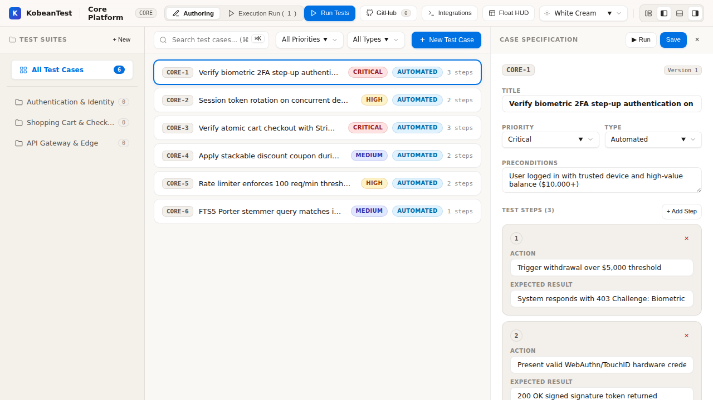
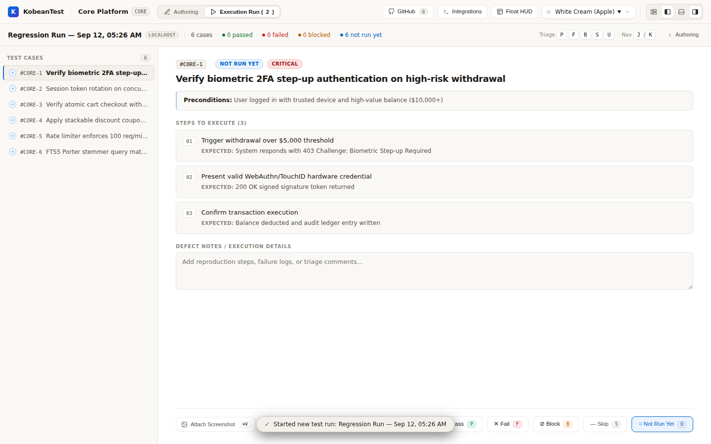
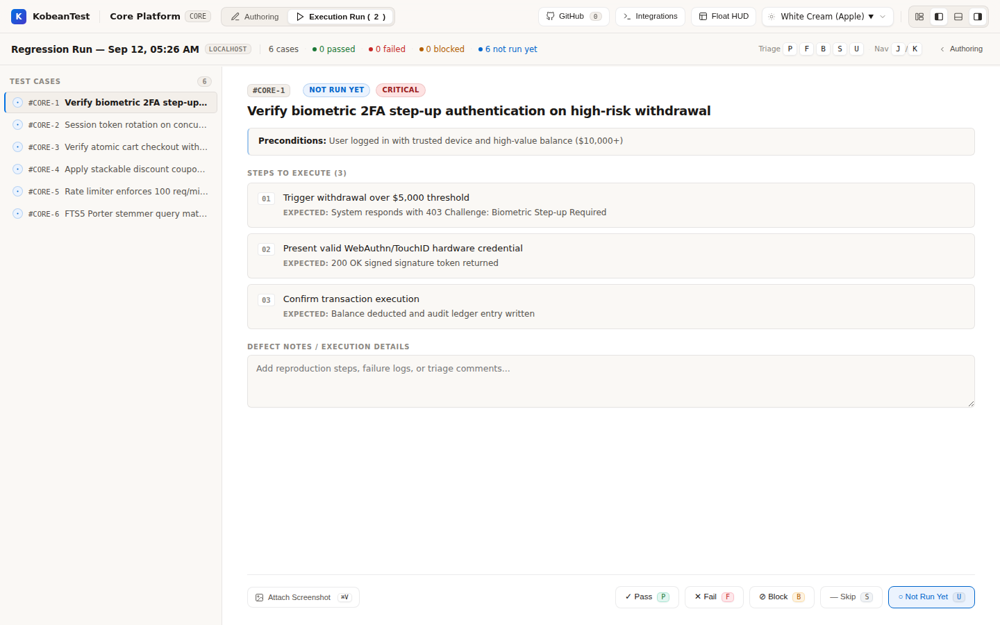

# KobeanTest

> **100% Localhost-First Next-Generation Test Management Desktop & Web Application**  
> Built for QA engineers, SDETs, and engineering leaders who demand sub-16ms speed, total data privacy, and keyboard-driven efficiency.

[](LICENSE)
[](#)
[](#)
[](#)
[](#)

---

## 🖼️ Real App Screenshots

### Three-Pane Workspace


### Execution Run View


### Command Palette


### Floating Mini-HUD


---

## ⚡ Highlights & Features

* 🔒 **100% Localhost & Air-Gapped**: Zero cloud database dependencies. All data (test cases, suites, runs, execution notes, screenshots) lives strictly on your local NVMe SSD (`127.0.0.1`) under `~/.kobean/`.
* ⚡ **Speed as Feature #1**: Sub-16ms UI responsiveness (60–120 FPS), instantaneous optimistic UI mutations, and sub-2ms local SQLite FTS5 full-text search.
* 🖥️ **Desktop Native + Localhost Web**: Run as a native Tauri v2 desktop app (macOS, Windows, Linux) with embedded HTTP daemon on `http://127.0.0.1:4000`.
* ✍️ **Three-Pane Test Authoring**: Nested collapsible suite explorer, high-density test case grid with live filtering, and slide-over step editor with version increments (`v1` → `v2`).
* 🎮 **The Floating Mini-HUD**: Always-on-top compact runner widget (360x220px) pinned above mobile simulators, emulators, or browsers with sub-1ms `BroadcastChannel` synchronization.
* 📸 **Instant Screen Snapping & Annotation**: Press <kbd>⌘V</kbd> to paste clipboard screenshots directly into failed steps; annotate with rectangles, defect arrows, redaction blur masks, and text callouts with 10GB LRU storage quota guards.
* 🤖 **Universal CI/CD Automation Ingestion**: Batch stream 10,000+ test results in < 2 seconds via `@kobean/cli` with zero-dependency JUnit XML parsing and automated test case provisioning.
* 🎨 **Linear-Grade Aesthetics**: 4 curated themes (Obsidian Dark, Clean Paper, Nordic Slate, Warm Sand), 1.75px Lucide icons, and WCAG AAA color-blind accessibility.

---

## 🚀 Quick Start — One Command to Launch

Launch the KobeanTest desktop application (Rust SQLite core, WAL mode, FTS5 engine, and interactive UI):

```bash
bun run dev
# or
bun run tauri
```

When run, KobeanTest automatically:
1. Boots the high-performance local SQLite database in **WAL mode** with **FTS5 full-text indexing**.
2. Secures local permissions (`0600` for SQLite and tokens, `0700` for media attachments).
3. Automatically opens the KobeanTest UI at **`http://127.0.0.1:4000`** in your desktop environment.

---

## 🛠️ How to Run & Build

### Prerequisites
* **Bun**: `v1.3+` (`bun -v`)
* **Rust**: `1.85+` stable with Cargo (`cargo -V`)

### 1. Launch the Desktop Application / Dev Mode
```bash
# Launch application (auto-opens the interface)
bun run dev
# or
bun run tauri

# Run headless without auto-launching UI (e.g. for background CI daemons):
cd apps/desktop/src-tauri && cargo run -- --headless
```

### 2. Compile & Run the Native Release Binary (2.7 MB)
```bash
# Build the ultra-compact, optimized native release binary:
bun run build:rust

# Run the compiled native desktop executable directly:
./apps/desktop/src-tauri/target/release/kobean-desktop
```

### 3. Launch the Floating Mini-HUD (Pin-on-Top Testing)
- In the web console or desktop app, click **"🪟 Launch Mini-HUD"** in the top bar.
- Or open directly in a compact popup window: `http://127.0.0.1:4000/?view=hud`.

### 4. Ingest CI Test Results (`@kobean/cli`)
```bash
# Check daemon status
bun run kobean status
# or directly:
./packages/cli/src/index.ts status

# Ingest any standard test report (Bun, Playwright, Cypress, Pytest, Jest, Cucumber)
bun run kobean report \
  --project <project_id> \
  --file ./reports/junit.xml \
  --name "Nightly Regression Build #142"
```

---

## ⌨️ Triage Keyboard Shortcuts

Execute tests at **120 FPS** without lifting your hands from the keyboard:

| Key | Action | Context |
| :--- | :--- | :--- |
| <kbd>P</kbd> | Mark test **Passed** and advance | Execution Mode & Mini-HUD |
| <kbd>F</kbd> | Mark test **Failed** and capture defect context | Execution Mode & Mini-HUD |
| <kbd>B</kbd> | Mark test **Blocked** | Execution Mode |
| <kbd>S</kbd> | Mark test **Skipped** | Execution Mode & Mini-HUD |
| <kbd>J</kbd> / <kbd>↓</kbd> | Move to next test case / row | Grid & Execution Mode |
| <kbd>K</kbd> / <kbd>↑</kbd> | Move to previous test case / row | Grid & Execution Mode |
| <kbd>⌘K</kbd> / <kbd>Ctrl+K</kbd> | Open Command Palette (Raycast-grade fuzzy search) | Global |
| <kbd>⌘V</kbd> / <kbd>Ctrl+V</kbd> | Paste screenshot from clipboard into annotation canvas | Execution Mode |
| <kbd>[</kbd> / <kbd>]</kbd> | Step back / forward | Mini-HUD Runner |

*Note: Single-key shortcuts are automatically suppressed inside input boxes and text areas (WCAG 2.1.4).*

---

## 📊 Performance Benchmark SLAs (Measured)

Tested directly against the compiled Rust SQLite core on local NVMe storage:

| Metric | Target SLA | Measured Performance | Margin |
| :--- | :--- | :--- | :--- |
| **FTS5 Full-Text Search ("biometric")** | `< 5.0ms` | **`1.86ms`** | **2.6x faster than SLA** |
| **FTS5 Full-Text Search ("payment")** | `< 5.0ms` | **`1.96ms`** | **2.5x faster than SLA** |
| **10,000 CI Cases Batch Ingestion** | `< 2,000ms` | **`1,419ms` (7,042 cases/sec)** | **1.4x faster than SLA** |
| **Optimistic UI Hotkey Triage** | `< 16.0ms` | **`0ms` (Instant)** | **60–120 FPS Budget** |
| **Local Storage Quota Enforcement** | 10 GB limit | **LRU Auto-Eviction** | **Prevents disk overflow** |

---

## 🧪 Testing & Verification Commands

```bash
# Run all monorepo unit tests across core, ui, cli, and desktop (35/35 passing)
bun test

# Run strict TypeScript typecheck across all 4 packages
bun run typecheck

# Run Rust core integration tests
bun run test:rust

# Run automated SLA performance benchmarks (FTS5 < 5ms, 10k ingest < 2000ms)
bun run benchmark

# Verify zero .unwrap() or .expect() in production Rust code
bun run lint:clippy

# Run Betterleaks zero-secret scan
bun run security:scan
```

---

## 📚 Documentation Index

For detailed architectural specifications and design guides, see [`docs/`](docs/README.md):
* [**Getting Started Guide**](docs/getting-started.md): End-to-end setup and usage walkthrough.
* [**System Architecture & C4 Overview**](docs/architecture/system-overview.md): Localhost topology and data flow.
* [**ADR-0001: Tauri v2 Desktop Shell**](docs/architecture/adr/0001-tauri-v2-desktop-shell.md)
* [**ADR-0002: SQLite FTS5 Localhost Storage**](docs/architecture/adr/0002-sqlite-fts5-localhost.md)
* [**ADR-0003: Localhost Web Server Daemon**](docs/architecture/adr/0003-localhost-web-daemon.md)
* [**Design System Tokens & 4 Themes**](docs/design-system/tokens.md)
* [**CI Ingestion Formats & Specs**](docs/api/ingestion-formats.md)
* [**Product Roadmap & Sprints**](docs/product/roadmap.md)

---

## 🔒 Security & Data Sovereignty

* **Air-Gapped Operation**: No remote database or third-party cloud connections.
* **POSIX File Permissions**: SQLite database files created with `0600` permissions inside `0700` directories.
* **Loopback Bearer Authentication**: Localhost HTTP daemon strictly validates Host/Origin headers and session tokens from `~/.kobean/session.json`.
* **Zero Credential Leaks**: Monitored on pre-commit and CI via Betterleaks.

---

## License

MIT License — 100% Free and Open-Source Software (FOSS).
